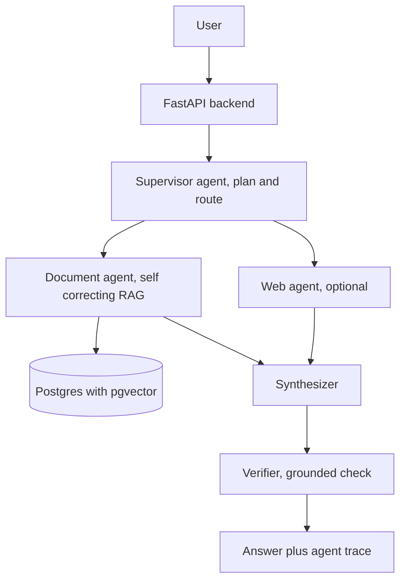

# rag-multiagent-2026

**A multi agent enterprise RAG. A supervisor routes specialist agents and a verifier checks the answer. Part of the RAG line.**

**Part of the RAG line, a series of reference enterprise RAG implementations. This repository is rag-multiagent-2026, Multi agent enterprise RAG.** See [the full line](#the-rag_naive-line) below.

rag-multiagent-2026 does not rely on a single chain or a single agent. A supervisor plans the work and routes the question to specialist worker agents, a synthesizer merges their findings, and a verifier checks the answer is grounded before it is returned. The document worker is the rag-agentic-2025 self correcting RAG over pgvector, so the system is an agent of agents. It runs fully locally on Ollama, with the Claude 5 family as the frontier cloud option.

[](https://github.com/mlvpatel/rag-multiagent-2026/actions/workflows/ci.yml)    


The clip above is a live, unedited run on a local qwen2.5 model over pgvector. The expandable trace shows the supervisor route the question, the document agent answer, and the verifier check it. No paid keys were used.

## The agents

| Agent | Role |
|---|---|
| Supervisor | Plans and routes the question to the right specialist agents, bounded so it always terminates |
| Document agent | The rag-agentic-2025 self correcting RAG over pgvector: retrieve, grade, rewrite, generate, self check |
| Web agent | Grounded web search, off by default, used only when the supervisor asks for it |
| Synthesizer | Merges the specialist findings into one grounded answer with sources |
| Verifier | Checks the answer is grounded in the findings before it is returned |

Every agent's contribution is recorded in a trace returned with the answer, the observability spine from the enterprise design. The orchestration is bounded, which is the cost guard.

## Architecture



## How to use

### Local, fully offline with Ollama (no paid keys)

```bash
# 1. Data services
make db-up             # postgres with pgvector, plus redis

# 2. Ollama and the local models
ollama serve &
ollama pull nomic-embed-text
ollama pull qwen2.5:7b-instruct

# 3. Install and run
make install
EMBEDDING_PROVIDER=ollama make dev        # API on :8000
make frontend                             # UI on :8501, second terminal
```

Load the bundled sample data with `make load-samples`, then ask a question and open the trace to watch which agents ran.

## Configuration

| Setting | Default | Meaning |
|---|---|---|
| EMBEDDING_PROVIDER | google | google or ollama |
| AGENT_ENABLE_WEB | false | grounded first; turn on to let the supervisor use the web agent |
| AGENT_CONFIDENCE_THRESHOLD | 0.6 | document agent grade gate |
| AGENT_MAX_STEPS | 12 | hard cap on the document agent's internal steps |
| API_KEY | change_me | required in the X-API-Key header |

## API reference

| Method and path | Purpose |
|---|---|
| GET /health | Liveness, no auth |
| POST /v1/chat | Multi agent answer with the agent trace and which agents ran |
| POST /v1/upload-doc | Upload and asynchronously index a document |
| GET /v1/list-docs | List indexed documents |
| POST /v1/delete-doc | Delete a document and its chunks |
| GET /metrics | Prometheus metrics |

## Testing

```bash
make test        # unit tests, no database or model needed
```

## The RAG line

This repo is the Multi agent (2026) rung. Each rung adds one idea and keeps the ones below it.

| Year | Repository | Strategy |
|---|---|---|
| 2022 | [rag-naive-2022](https://github.com/mlvpatel/rag-naive-2022) | Naive: one dense search over Chroma |
| 2023 | [rag-advanced-2023](https://github.com/mlvpatel/rag-advanced-2023) | Advanced: hybrid, RRF and cross encoder, in Python |
| 2023 | [rag-modular-2023](https://github.com/mlvpatel/rag-modular-2023) | Modular: pgvector, RRF in SQL, streaming, memory, evaluation |
| 2024 | [rag-graph-2024](https://github.com/mlvpatel/rag-graph-2024) | Graph: entity and triple knowledge graph linked into answers |
| 2024 | [rag-cache-2024](https://github.com/mlvpatel/rag-cache-2024) | Cache: no retrieval, corpus in context with a semantic cache |
| 2025 | [rag-agentic-2025](https://github.com/mlvpatel/rag-agentic-2025) | Agentic: bounded self correcting loop, confidence gated |
| 2026 | rag-multiagent-2026, this repo | Multi agent: supervisor, specialists, verifier |
| 2026 | [rag-multimodal-2026](https://github.com/mlvpatel/rag-multimodal-2026) | Multimodal: text and images in one vector space |

## Author

Malav Patel. GitHub @mlvpatel.

## License

Released under the MIT License. See [LICENSE](LICENSE). MIT is the simplest and most permissive of the common licenses, so anyone can read, run, modify, and reuse the code freely.
