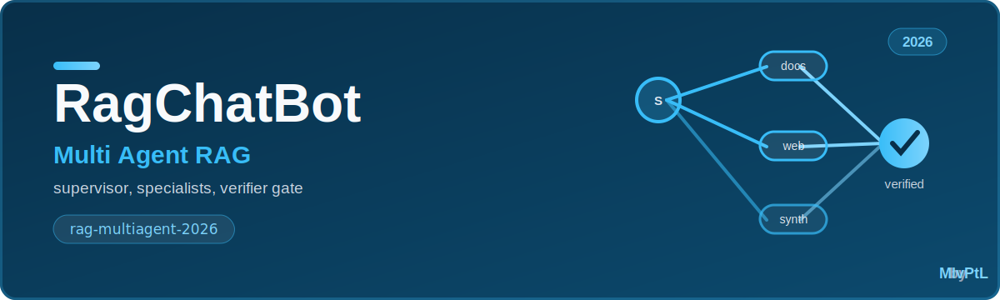
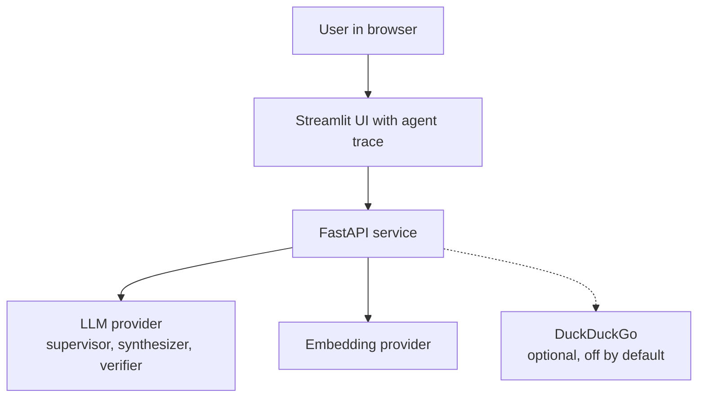
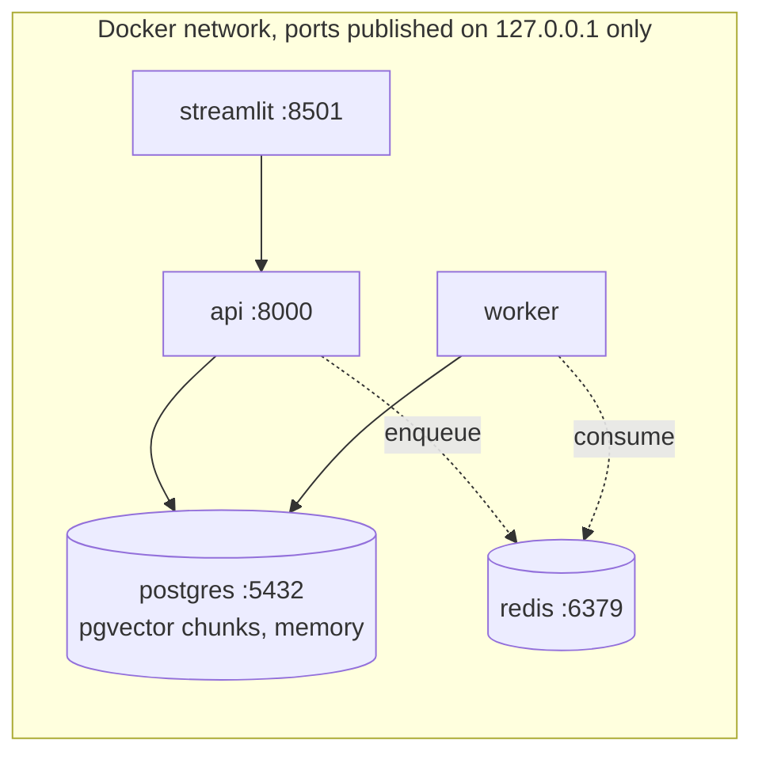
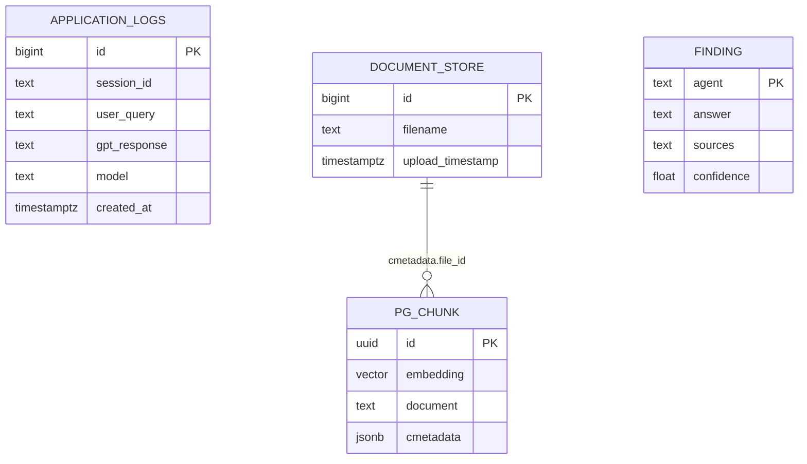
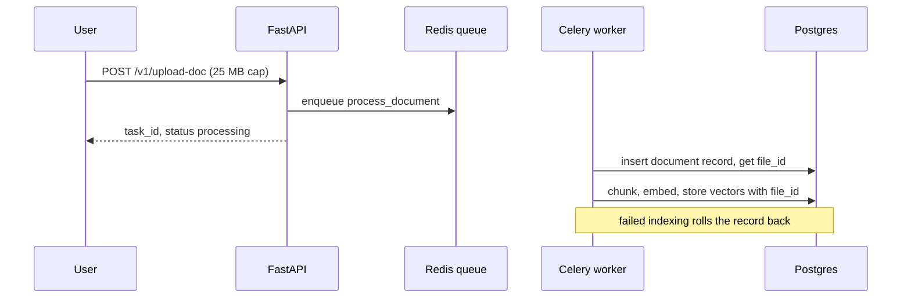
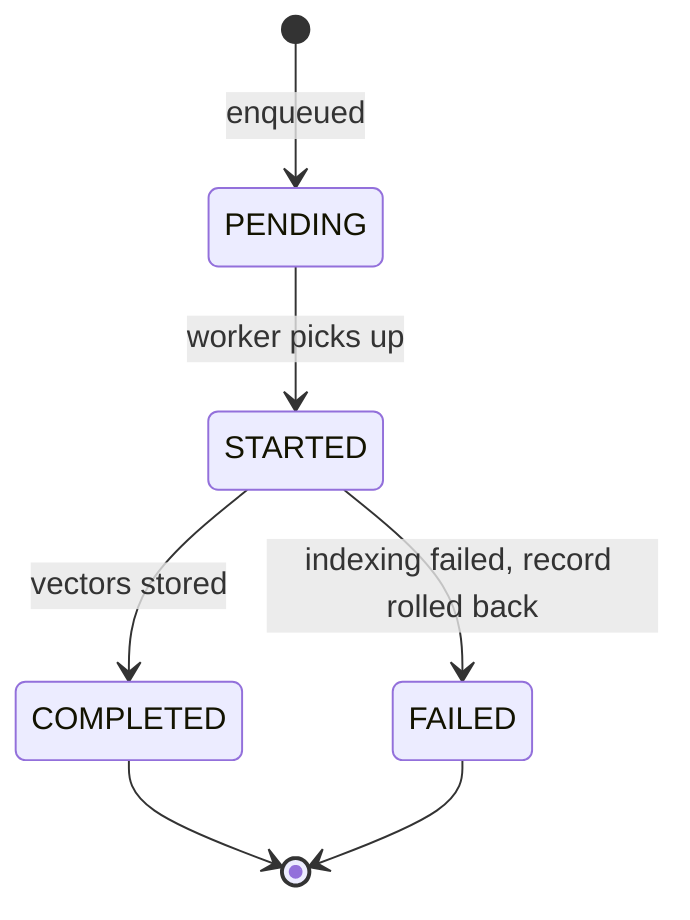
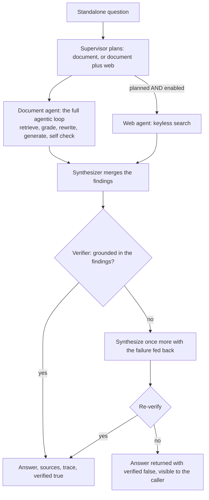
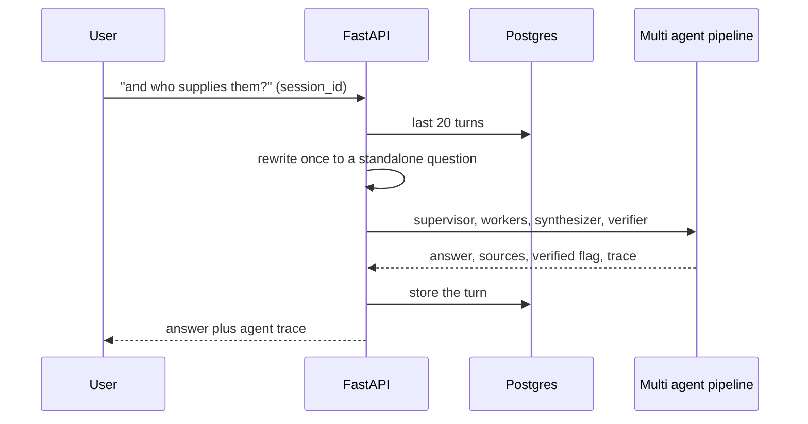

# rag-multiagent-2026

**A multi agent enterprise RAG: a supervisor routes specialist worker agents, a synthesizer merges their findings, and a verifier gates the answer on grounding before it is returned. The Multi agent (2026) rung of the RAG line.**

Part of the RAG line, a series of reference enterprise RAG implementations, one per retrieval strategy. This repository is the Multi agent (2026) rung. See [the full line](#the-rag-line) below.

[](https://github.com/mlvpatel/rag-multiagent-2026/actions/workflows/ci.yml)    



## Contents

- [The agents](#the-agents)
- [Tech stack](#tech-stack)
- [Architecture](#architecture)
- [Data model](#data-model)
- [How ingestion works](#how-ingestion-works)
- [How a question is answered](#how-a-question-is-answered)
- [Memory](#memory)
- [The mathematics](#the-mathematics)
- [How to use](#how-to-use)
- [Configuration](#configuration)
- [API reference](#api-reference)
- [A note on access](#a-note-on-access)
- [Testing](#testing)
- [Project structure](#project-structure)
- [The RAG line](#the-rag-line)

## The agents

One agent doing everything is one context window doing everything. This rung splits the work across specialists and adds an output gate:

| Agent | Role |
|---|---|
| Supervisor | Plans and routes the question to the right specialist agents |
| Document agent | The rag-agentic-2025 self correcting RAG over pgvector: retrieve, grade, rewrite, generate, self check |
| Web agent | Grounded web search, off by default, used only when the supervisor asks for it and it is enabled |
| Synthesizer | Merges the specialist findings into one grounded answer with sources |
| Verifier | Checks the answer is grounded in the findings; an unverified answer is synthesized once more with the failure fed back, then re-verified |

Every agent's contribution is recorded in a trace returned with the answer, the observability spine of the design. The orchestration is bounded end to end, which is the cost guard: the inner document agent carries its own loop bounds, and the outer pipeline runs each stage a fixed number of times.

## Tech stack

| Component | Choice | Why this one |
|---|---|---|
| Orchestration | A supervisor prompt over plain function calls | The routing decision is one JSON verdict; a framework would hide it |
| Inner agent | LangGraph (the rag-agentic-2025 graph, reused) | Composition over reinvention: the document worker IS the previous rung |
| API | FastAPI | Async, typed, OpenAPI for free |
| Vector store | pgvector on Postgres 16 | Chunks and memory in one database |
| Retrieval | Hybrid RRF in SQL + bge-reranker-v2-m3 | Inherited from the line, unchanged |
| Verifier | The same chat model at temperature 0, fail-closed parsing | A gate that cannot read its own verdict must not pass it |
| Web tool | DuckDuckGo via ddgs, off by default | Keyless, grounded first |
| Embeddings | Google gemini-embedding-001 or Ollama nomic-embed-text | Ollama for a fully local run |
| Memory | Postgres | Windowed history, one reformulation feeds every agent |
| Ingestion | Celery + Redis | Async indexing |
| UI | Streamlit | Chat surface with the agent trace and a verified badge |
| CI | GitHub Actions | Lint, unit tests, pip-audit with no suppressions |

## Architecture

System context:



Containers:



## Data model



`FINDING` is transient, one per specialist per question, but it is the contract that makes the system composable: the synthesizer and the verifier only ever see findings, never raw retrieval, so a new specialist plugs in by producing one.

## How ingestion works



Task lifecycle:



## How a question is answered



The gate is deliberate about its failure mode: a second rejection does not loop forever, it returns the answer with `verified: false` so the caller decides. And the verifier's parser fails closed, an unreadable verdict counts as a rejection, because a gate that cannot read its own verdict must not pass it.

## Memory

Turns are stored per `session_id` in Postgres, windowed to the last 20 turns. The follow-up is rewritten into a standalone question once, at the top, and that one rewrite feeds the supervisor, the workers, the synthesizer, and the verifier, so every agent reasons about the same fully resolved question.



## The mathematics

**The routing decision.** The supervisor emits a plan $P \subseteq \{\text{document}, \text{web}\}$ as one JSON verdict, and the pipeline enforces $\text{document} \in P$ unconditionally: the internal corpus is always consulted, the web is additive. The web worker runs only when $\text{web} \in P$ and the deployment enables it, so the default behaviour is fully grounded in your own documents.

**The verifier gate.** Let $v(a) \in \{0, 1\}$ be the verifier's verdict on answer $a$ against the findings $F$. The returned answer is

$$a^* = \begin{cases} a_1 & v(a_1) = 1 \\ a_2 & v(a_1) = 0 \end{cases} \qquad \text{verified} = v(a^*)$$

where $a_2$ is synthesized with the rejection reason fed back. Exactly one retry: the second verdict is final and travels with the answer. Parsing failures map to $v = 0$, never $1$.

**Why the gate is worth one extra call.** With a synthesizer hallucination rate $p$ and a verifier that catches a hallucination with sensitivity $s$, the rate of unflagged hallucinated answers drops from $p$ to

$$p \cdot \big(1 - s\big) + p^2 s \cdot \big(1 - s\big) \;\approx\; p(1 - s)$$

for small $p$: the gate multiplies the failure rate by the verifier's miss rate. The price is one verification call always, and one regeneration only when something was actually caught.

**Bounded cost.** The outer pipeline is loop free: reformulate (at most 1), supervisor (1), workers (at most 2), synthesizer (at most 2), verifier (at most 2). The inner document agent carries its own bounds (attempts $\leq 2$, generations $< 2$, steps $\leq 12$), so the total model-call count for one question is bounded by a constant, which is what makes the system billable.

**Retrieval, inherited.** The document worker's retrieval is the line's hybrid: dense pgvector cosine plus sparse `ts_rank`, fused inside one SQL query with

$$\text{RRF}(d) = \frac{1}{k + r_{\text{dense}}} + \frac{1}{k + r_{\text{sparse}}}, \qquad k = 60$$

over 1-based ranks, then a cross encoder rerank to the top 5. Nothing about multi agent changes the retrieval math; the composition is the contribution.

## How to use

### Local, fully offline with Ollama (no paid keys)

```bash
# 1. Data services
make db-up             # postgres with pgvector, plus redis

# 2. Ollama and the local models
ollama serve &
ollama pull nomic-embed-text
ollama pull qwen2.5:7b-instruct

# 3. Install and run
make install
EMBEDDING_PROVIDER=ollama make dev        # API on :8000
make frontend                             # UI on :8501, second terminal
```

Ask a question and open the trace under the answer to watch the supervisor route, the document agent work, and the verifier pass judgement.

### Try it with the bundled sample data

The repo ships sample documents in [sample_data](sample_data), an HR handbook, a product FAQ, and a real SEC 10-K excerpt. With the stack up:

```bash
make load-samples
```

Then ask the questions in [sample_data/README.md](sample_data/README.md), including an honesty check where the system should say it does not have the information rather than guess.

## Configuration

| Setting | Default | Meaning |
|---|---|---|
| EMBEDDING_PROVIDER | google | google or ollama |
| AGENT_CONFIDENCE_THRESHOLD | 0.6 | Inner agent: a grade at or above this counts as relevant |
| AGENT_MAX_RETRIEVAL_ATTEMPTS | 2 | Inner agent: bounded rewrite and retry |
| AGENT_ENABLE_WEB | false | Allows the web worker when the supervisor plans it |
| AGENT_MAX_STEPS | 12 | Inner agent: hard cap on graph steps |
| TOP_K / RERANKER_TOP_N | 5 / 5 | Final chunk counts per stage |
| MAX_UPLOAD_MB | 25 | Uploads rejected above this size |
| ALLOWED_ORIGINS | http://localhost:8501 | CORS allowlist |

## API reference

| Method and path | Purpose | Limit |
|---|---|---|
| GET /health | Liveness | none |
| GET /metrics | Prometheus metrics | none |
| POST /v1/chat | Multi agent answer with trace, sources, verified flag | 60/min |
| POST /v1/upload-doc | Upload, queue async indexing | 10/min, 25 MB |
| GET /v1/task/{task_id} | Poll indexing status | none |
| GET /v1/list-docs | List indexed documents | none |
| POST /v1/delete-doc | Delete a document and its chunks | none |

## A note on access

The service has no authentication, and that is a decision rather than an omission. It is a reference implementation meant to run on one machine: docker compose binds every published port, Postgres and Redis included, to `127.0.0.1`, and the containers run as a non-root user. A shipped default credential would be the worse option, since it reads as protection while sitting in a public repository. What remains is real: per route rate limiting, a hard size cap on uploads, HTML stripping on every question, and a narrow CORS origin. Put an authenticating gateway in front before exposing any of it beyond loopback.

## Testing

```bash
make test        # unit tests, no database or model needed
```

Unit tests cover the verifier gate end to end (an unverified answer regenerates once with the failure fed back and the final flag reflects the second verdict), that an unparseable verdict fails closed, that a verified answer returns without a retry, that one reformulation feeds the supervisor and the workers (with no history passed down twice), every routing branch of the inner agent, the windowed history query, and the API contract without credentials. Integration tests run against a live Postgres and Ollama when reachable. A retrieval evaluation harness lives in [eval](eval).

## Project structure

```
src/agent/        multiagent orchestration plus the inner agentic graph
src/api/          FastAPI app, endpoints, Postgres memory
src/core/         config, chain helpers, logging
src/embeddings/   pgvector store and embedding providers
src/retrieval/    hybrid retriever and reranker
src/worker/       Celery app and the indexing task
eval/             golden questions and retrieval metrics
frontend/         Streamlit UI with the agent trace
sample_data/      runnable sample documents
tests/            unit and integration tests
docker/           Dockerfile and Compose stack
```

## The RAG line

This repo is the Multi agent (2026) rung. Each rung adds one idea and keeps the ones below it.

| Year | Repository | Strategy |
|---|---|---|
| 2022 | [rag-naive-2022](https://github.com/mlvpatel/rag-naive-2022) | Naive: one dense search over Chroma |
| 2023 | [rag-advanced-2023](https://github.com/mlvpatel/rag-advanced-2023) | Advanced: hybrid, RRF and cross encoder, in Python |
| 2023 | [rag-modular-2023](https://github.com/mlvpatel/rag-modular-2023) | Modular: pgvector, RRF in SQL, streaming, memory, evaluation |
| 2024 | [rag-graph-2024](https://github.com/mlvpatel/rag-graph-2024) | Graph: entity and triple knowledge graph linked into answers |
| 2024 | [rag-cache-2024](https://github.com/mlvpatel/rag-cache-2024) | Cache: no retrieval, corpus in context with a semantic cache |
| 2025 | [rag-agentic-2025](https://github.com/mlvpatel/rag-agentic-2025) | Agentic: bounded self correcting loop, confidence gated |
| 2026 | rag-multiagent-2026, this repo | Multi agent: supervisor, specialists, verifier |
| 2026 | [rag-multimodal-2026](https://github.com/mlvpatel/rag-multimodal-2026) | Multimodal: text and images in one vector space |

## Author

Malav Patel. GitHub [@mlvpatel](https://github.com/mlvpatel).

## License

Released under the MIT License. See [LICENSE](LICENSE).
